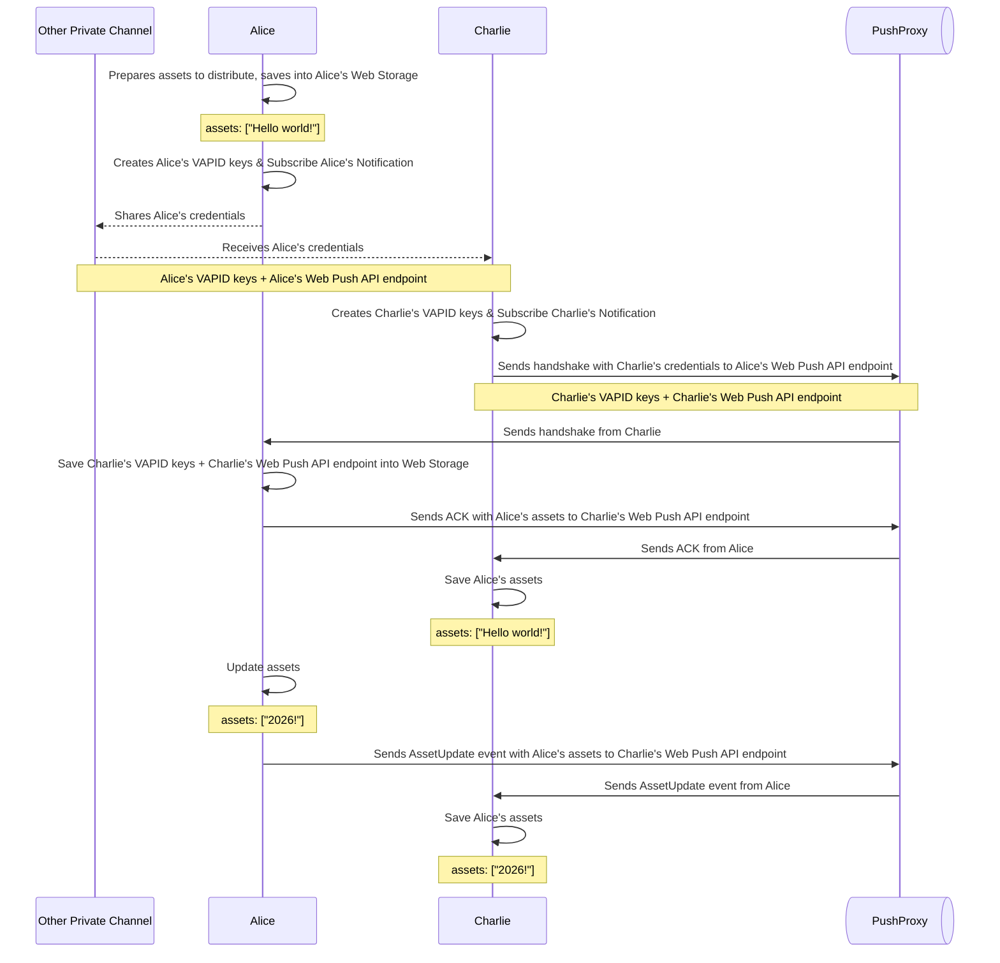

# [BaaB](https://baab.atj.sh) - Browser as a Backend

**Make your web browser as a backend** to securely share small assets.

# How to use

## iOS and iPadOS

If you are using iOS or iPadOS: at least iOS/iPadOS 16.4 is required.

BaaB uses [Web Push API](https://developer.mozilla.org/en-US/docs/Web/API/Push_API) technology. **All participants** (server and clients) **must add the BaaB instance to their home screen** to enable the technology.

1. Open the [BaaB instance(https://baab.atj.sh)](https://baab.atj.sh) in Safari.
2. Tap the "Share" button in the Safari toolbar.
3. Tap "Add to Home Screen".
4. Open the BaaB instance from the home screen.

Learn more about [How to add a website to Home Screen](https://support.apple.com/guide/iphone/bookmark-a-website-iph42ab2f3a7/ios#iph4f9a47bbc).

## macOS

If you are using macOS: at least macOS 13 with Safari 16 is required.

## Other Platforms

- The browser with free Web Push API support
  - [Google Chrome](https://www.google.com/chrome/)
  - [Microsoft Edge](https://www.microsoft.com/edge)
  - [Mozilla Firefox](https://www.mozilla.org/firefox/)
- Or, a modern web browser with following features:
  - [Service Worker](https://developer.mozilla.org/en-US/docs/Web/API/ServiceWorker)
  - [Web Notifications API](https://developer.mozilla.org/en-US/docs/Web/API/Notifications_API)
  - [Web Push API](https://developer.mozilla.org/en-US/docs/Web/API/Push_API)
  - [Web Storage API](https://developer.mozilla.org/en-US/docs/Web/API/Web_Storage_API) (localStorage)

We recommend to use browsers with free Web Push API support above.

Other browsers do work; However, other browsers like _Samsung Internet Browser_ requires developers to register a GCM sender ID to use Web Push API.

## As a server, to share assets

### Start a server

1. [Visit my BaaB instance](https://baab.atj.sh) to start a BaaB worker in your web browser.
2. "Allow notifications" when prompted.
3. Share a link to your BaaB worker with clients, through a private channel (e.g., in person, online DM, or printed QR code).

These will happen:

- New clients can connect to your BaaB worker using the link.
- Latest assets will be sent to the new clients.

### Update your assets

1. Open the BaaB worker in your web browser.
2. Update your assets
3. Click "Update Assets" button.

These will happen:

- All connected clients will receive the updated assets.

### Close the server and forget all clients

1. Open the BaaB worker in your web browser.
2. Click "Close Server" button.

These will happen:

- Existing links to your BaaB worker become invalid.
- No new client can connect to your BaaB worker.
- No existing client can receive asset updates from you.

## As a client, to receive assets from a server

### Connect to a server

1. Get a link from the server.
2. Open the link in your web browser.
3. "Allow notifications" when prompted.

These will happen:

- You will receive the latest assets from the server.
- You will receive asset updates from the server, through web browser's push notification system.

### Disconnect from the server and forget the server

1. Open the BaaB worker in your web browser.
2. Click "Disconnect" button.

These will happen:

- You will no longer receive asset updates from the server.

(You can still reconnect to the server later using the same link, unless the server has been closed.)

# How it works

Let's say: Alice is a server, Charlie is a client.

1. Alice opens a BaaB worker in their web browser. They create their own VAPID keys and subscribe to push notifications.
2. Alice creates a URL containing their subscription info and VAPID public key, and shares it with Charlie through a private channel (e.g., e-mail, online DM, or printed QR code).
3. Charlie opens the URL in their web browser.
4. Charlie creates their own VAPID keys and subscribes to push notifications.
5. Charlie sends a handshake to Alice with Charlie's subscription info and VAPID public key through a push proxy server.
6. Alice receives the handshake with Charlie's subscription info. Now Alice can send notifications to Charlie, and Charlie can send notifications to Alice.

And now Alice and Charlie can communicate through push notifications!

## What is the push proxy server?

The BaaB push proxy server is a relay server. It is different from the web browser vendor's push notification server (e.g., Apple Push Notification service, Firebase Cloud Messaging).

Why such push proxy server is needed? Because major vendor's push notification servers uses CORS policy that disallows 'direct peer-to-peer push notifications' between peers.

# Limitations

The best use case for BaaB is to share small assets (e.g., text snippets, small images) in a secure way, with minimal infrastructure.

The web technologies used in BaaB are inherently fragile.

- Web Push API subscriptions can be revoked by users at any time.
- Service Workers can be unregistered by users at any time.
- Browsers can clear Web Storage at any time.
- Browsers can stop background processes (e.g., Service Workers) at any time, which can stop clients to handshake with servers.
- Browsers can change their implementation of Web Push API at any time.

# Self-hosting

You can self-host your own BaaB system.

## BaaB push proxy server

You can self-host your own BaaB push proxy server. See [apps/server/README.md](apps/server/README.md) for more details.

## BaaB web app

You can self-host your own BaaB web app. See [apps/web/README.md](apps/web/README.md) for more details.

# Licenses

See [LICENSE](LICENSE).
