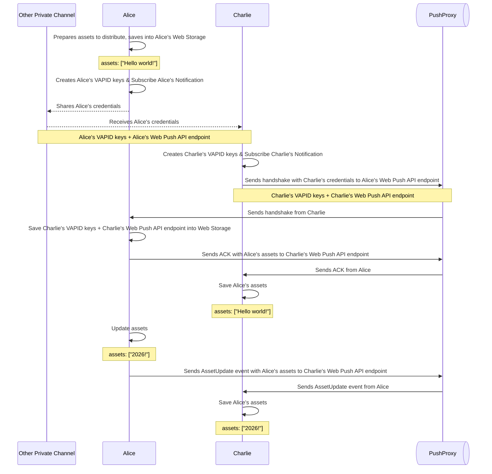

# baab

Browser as a Backend; Make your device's web browser as a HTTP backend server

# How to use

## As a server

1. Start a baab worker in your web browser. "Allow notifications" when prompted.
2. Share a link to your baab worker with consumers, through a private channel (e.g., in person, online DM, or printed QR code).
3. Consumers can now access your assets through your web browser

## As a client

1. Get a link from the server.
2. Open the link in your web browser.
3. "Allow notifications" when prompted.

# How it works

Let's say: Alice is a server, Charlie is a client.

1. Alice opens a baab worker in their web browser. They create their own VAPID keys and subscribe to push notifications.
2. Alice creates a URL containing their subscription info and VAPID public key, and shares it with Charlie through a secure channel.
3. Charlie opens the URL in their web browser.
4. Charlie creates their own VAPID keys and subscribes to push notifications.
5. Charlie sends a notification to Alice with Charlie's subscription info and VAPID public key.
6. Alice receives the notification with Charlie's subscription info. Now Alice can send notifications to Charlie, and Charlie can send notifications to Alice.

And now Alice and Charlie can communicate through push notifications!

When Charlie sends a notification to Alice, that notification goes through a proxy server. The proxy server is only used to forward notifications between Alice and Charlie. The proxy server does not store any data, and does not have access to the content of the notifications, because it has been encrypted.

# Designed to be fragile

The best use case for baab is to share small assets (e.g., text snippets, small images) in a secure way without relying on any third-party services.

They are ment to be used in short-lived scenarios, e.g., sharing a text snippet during a meeting, sharing an image during a chat.

Web Notifications API are inherently unreliable, and are not designed for high availability or high performance. Notifications may be delayed, dropped, or not delivered at all.
