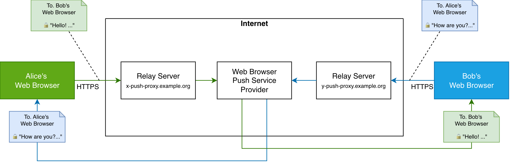
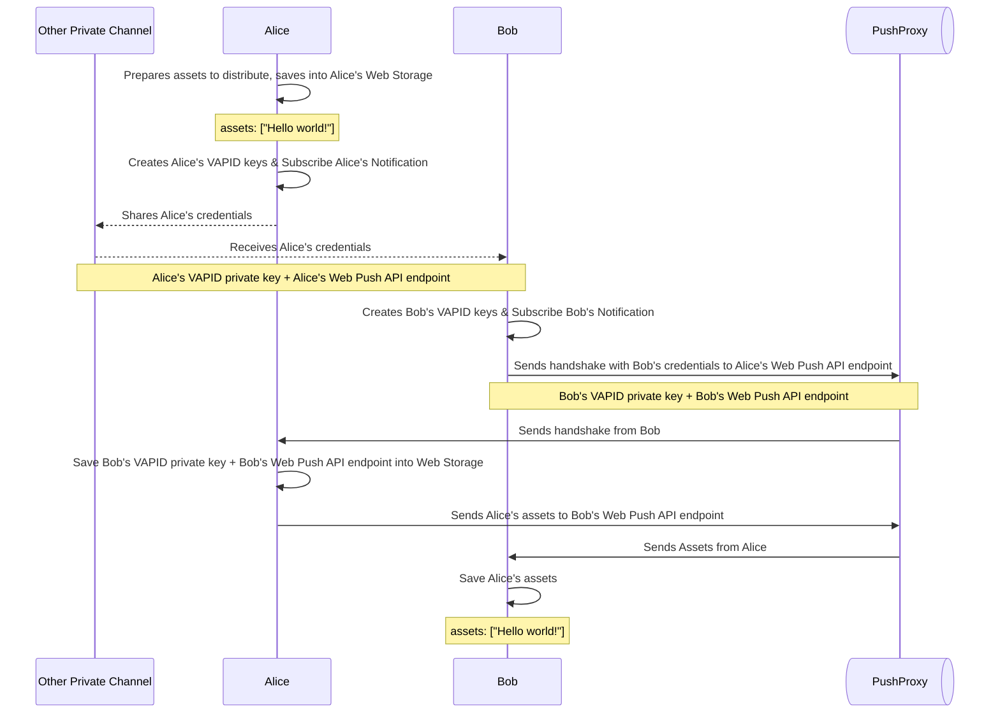

# [BaaB](https://baab.atj.sh) - End-to-End Encrypted Communication Between Web Browsers Using Web Push API

BaaB aims to implement a end-to-end encrypted communication system by utilizing standard web technologies and web browser's built-in push notification systems. Using BaaB only requires a remote or local relay server and a web browser with Web Push API support. After initial bootstrapping by sharing one's Web Push API subscription info and VAPID private key, peers can communicate in E2EE manner using Web Push API.

## Highlights

- Privacy: Relay servers only handles encrypted message payloads and web browser push subscription credentials that can be rotated anytime. Web browser's own push notification systems cannot decrypt the message payloads, only deliver them.
- Resilience to Censorship: BaaB relys on the general availability of web browser's push notification systems, makes difficult to censor or block the communication. All messages are delivered through standard Web Push API, which supports native message encryption. Relay servers are stateless, so they can be rotated or replaced in case of server block.
- Rich Communication: BaaB supports messaging and asset sharing, providing rich communication experience while keeping security. Users can host or join sessions with their devices' web browsers without installing additional app, executable, or extension.
- Open Source: This is an open source project based on open web standards. You can verify the implementation, host your own BaaB instance, or contribute to the project.

# Try it out

## iOS and iPadOS

If you are using iOS or iPadOS: at least iOS/iPadOS 16.4 is required.

BaaB uses [Web Push API](https://developer.mozilla.org/en-US/docs/Web/API/Push_API) technology. **All participants must add the BaaB instance to their home screen** to enable the technology.

1. Open the [BaaB instance(https://baab.atj.sh)](https://baab.atj.sh) in Safari.
2. Tap the "Share" button in the Safari toolbar.
3. Tap "Add to Home Screen".
4. Open the BaaB instance from the home screen.

Learn more about [How to add a website to Home Screen](https://support.apple.com/guide/iphone/bookmark-a-website-iph42ab2f3a7/ios#iph4f9a47bbc).

## macOS

If you are using macOS: at least macOS 13 with Safari 16 is required.

## Other Platforms

- The browser with free Web Push API support
  - [Apple Safari](https://www.apple.com/safari/)
  - [Mozilla Firefox](https://www.mozilla.org/firefox/)
  - [Google Chrome](https://www.google.com/chrome/)
  - [Microsoft Edge](https://www.microsoft.com/edge)
- Or, a modern web browser with following features:
  - [Web Push API](https://developer.mozilla.org/en-US/docs/Web/API/Push_API)
  - [Web Notifications API](https://developer.mozilla.org/en-US/docs/Web/API/Notifications_API)
  - [Web Storage API](https://developer.mozilla.org/en-US/docs/Web/API/Web_Storage_API) (IndexedDB)

# Usage

- Host chat sessions (1:1, bidirectional communication)
- Host image/text/file sharing sessions (1:N, unidirectional communication)

## Host a chat session

You can host or join a chat session. As a host, you should share your web browser's credentials, in form of a standard URL. After that, the other party can send you a encrypted handshake message to establish a secure communication channel.

### Start hosting a session

1. [Open BaaB web app](https://baab.atj.sh).
2. Go "Chat" tab.
3. "Allow notifications" when prompted.
4. Share a link to your BaaB worker with clients, through other private channel (e.g., in person, online DM, or printed QR code).

These will happen:

- New clients can connect to your BaaB worker using the link.

### Stop hosting a session

1. Open the BaaB worker in your web browser.
2. Click "Close Session" button.

These will happen:

- Existing links to your BaaB worker become invalid.
- No new client can connect to your BaaB worker.

### Join a session

1. Get a link from the session host.
2. Open the link in your web browser.
3. "Allow notifications" when prompted.

### Leave a session

1. Open the BaaB worker in your web browser.
2. Click "Disconnect" button.

These will happen:

- You will no longer receive asset updates from the server.

(You can still reconnect to the session later using the same link, unless the session has been closed.)

## Host a asset sharing session

You can share your assets (e.g., text snippets, images) with multiple others. As a host, you should share your web browser's credentials, in form of a standard URL. After that, the other party can connect to your BaaB worker to receive the latest assets. You can update the assets later, and all connected clients will receive the updated assets.

### Start asset sharing

1. [Go to BaaB web app](https://baab.atj.sh).
2. Go "Share" tab.
3. "Allow notifications" when prompted.
4. Share a link to your BaaB worker with clients, through other private channel (e.g., in person, online DM, or printed QR code).

These will happen:

- New clients can connect to your BaaB worker using the link.
- Latest assets will be sent to the new clients.

### Update your assets

1. Open the BaaB worker in your web browser.
2. Update your assets
3. Click "Update Assets" button.

These will happen:

- All connected clients will receive the updated assets.

### Stop asset hosting

1. Open the BaaB worker in your web browser.
2. Click "Close Server" button.

These will happen:

- Existing links to your BaaB worker become invalid.
- No new client can connect to your BaaB worker.
- No existing client can receive asset updates from you.

### Recieve assets

1. Get a link from the server.
2. Open the link in your web browser.
3. "Allow notifications" when prompted.

These will happen:

- You will receive the latest assets from the server.
- You will receive asset updates from the server, through web browser's push notification system.

### Disconnect from the server and forget the server

1. Open the BaaB worker in your web browser.
2. Click "Disconnect" button.

These will happen:

- You will no longer receive asset updates from the server.

(You can still reconnect to the server later using the same link, unless the server has been closed.)

# How it works

Let's say: Alice is a server, Bob is a client.

1. Alice opens a BaaB worker in their web browser. They create their own VAPID keys and subscribe to push notifications.
2. Alice creates a URL containing their subscription info and VAPID keys, and shares it with Bob through a private channel (e.g., e-mail, online DM, or printed QR code).
3. Bob opens the URL in their web browser.
4. Bob creates their own VAPID keys and subscribes to push notifications.
5. Bob sends a handshake to Alice with Bob's subscription info and VAPID keys through a push proxy server.
6. Alice receives the handshake with Bob's subscription info. Now Alice can send notifications to Bob, and Bob can send notifications to Alice.
7. From now on, Alice can send encrypted assets to Bob using Web Push API, and Bob can receive the assets even when Alice has closed the browser tab.

# Licenses

See [LICENSE](LICENSE).
